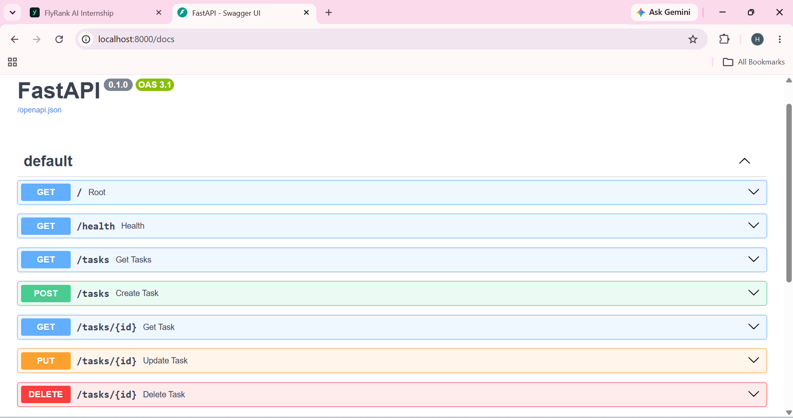

# Task API

Simple CRUD API built using FastAPI.

## Installation
```
pip install -r requirements.txt
```
## Run
```
uvicorn app:app --reload
```
## Endpoints
GET /  
GET /health  
GET /tasks  
GET /tasks/{id}  
POST /tasks  
PUT /tasks/{id}  
DELETE /tasks/{id}

## Example

curl -X GET http://localhost:8000/tasks

## Swagger

http://localhost:8000/docs

<p align="center">
  
</p>
