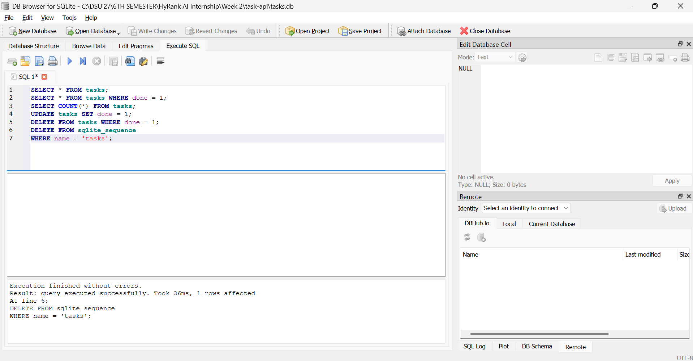

# Task API

Simple CRUD API built using FastAPI.

## Features
- Create, Read, Update, and Delete tasks
- Persistent storage using SQLite
- Interactive API documentation with Swagger UI

## Why SQLite?  
SQLite was chosen because it is lightweight, serverless, and stores data in a single file. It requires no separate database server and keeps data persistent even after the application restarts.

## Database  
The application stores data in a SQLite database file named:  
tasks.db  
If the database file does not exist, the application automatically:  
- Creates tasks.db  
- Creates the tasks table  
- Seeds three sample tasks (only when the table is empty)

## Installation
```
pip install -r requirements.txt
```
## Run
```
uvicorn app:app --reload
```
## Endpoints

GET /  
GET /health  
GET /tasks  
GET /tasks/{id}  
POST /tasks  
PUT /tasks/{id}  
DELETE /tasks/{id}  

## Example

curl -X GET http://localhost:8000/tasks

## Swagger

http://localhost:8000/docs

<p align="center">
  
</p>

## Database Viewer
<p align="center"> 
   
</p>

## Example SQL Query
SELECT COUNT(*) FROM tasks;  
This query returns the total number of tasks currently stored in the SQLite database.  

## Technologies Used
- Python  
- FastAPI  
- SQLite  
- DB Browser for SQLite  
- Uvicorn  

## Notes
- The database is created automatically when the application starts for the first time.  
- The tasks table is created automatically if it does not exist.  
- Sample tasks are inserted only when the table is empty.  
- SQL queries use parameterized placeholders (?) to help prevent SQL injection.  
